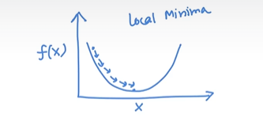
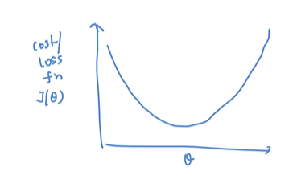
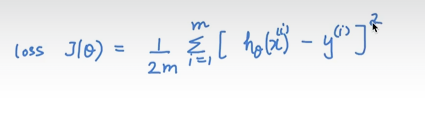
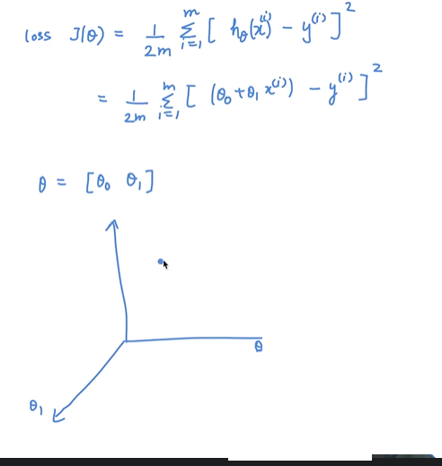
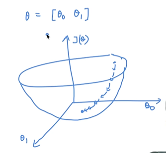

# Gradient Descent Algorithm

we want to minimize f(X) and at what value of x the function is minimum.

we see that starting with any random x we can apply gradient descent and it will converge to **local minima**

> local minima == global minima

cost/loss function = J(0)

at what value of 0 theta the loss is minimum.

if you take any random theta the gradient descent is going to do is to take that theta;  where the loss is minimum.

